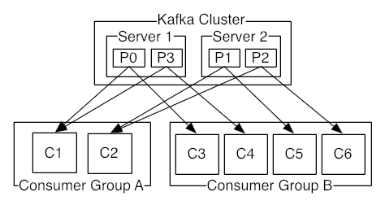

# Apache Kafka

카프카란? 대량신속처리 분산 메시지 시스템 , 여러 마이크로서비스 환경에서 이벤트 버스 공유가 가능하며 Http보다 속도가 빠르며 Subscribe에서 본인 시스템에 맞게 알아서 처리하여 가용성이 높으며 이벤트 버스는 비동기 방식이다. 

* 다중 프로듀서, 다중 컨슈머, 확장성
* 파티션에 있는 메시지 삭제 여부 등 설정 가

1. **Publish/Subscribe**

* 카프카는 기본적으로Publish-Subscribe 모델을 구현한 분산 메시징 시스템이다. Publish-Subscribe 모델은 데이터를 만들어내는 프로듀서\(Producer, 생산자\), 소비하는 컨슈머\(Consumer, 소비자\) 그리고 이 둘 사이에서 중재자 역할을 하는 브로커\(Broker\)로 구성된 느슨한 결합\(Loosely Coupled\)의 시스템이다. 
* 프로듀서는 브로커에게 데이터를 발행\(publish\)
* 커슈커가 브로커에 있는 데이터를 구독\(subscribe\)
* 프로듀서는 특정 토픽\(Topic-데이터 단\)으로 메시지를 발행할 수 있다. 컨슈머 역시 특정 토픽의 메시지를 읽어 갈 수 있다.

2. 토픽/파티션

* 토픽은 파티션으로 구성 되어 있다.
* 기본적으로 프로듀서는 발행한 메시지가 어떤 파티션에 저장되는지 관여하지 않는다. \(메시지 키와 파티셔너를 이용하여 특정 파티션으로 메시지를 전송할 수 있도록 할 수도 있다.-전송 순서가 중요할 경\) 각 파티션은 카프카 클러스터를 구성하는 브로커들\(서버?\)이 고루 나눠 갖는다. 
* 컨슈머는 파티션 안에 있는 메시지를 오래된 것부터 읽어가며 몇번째를 읽고 있는지 offset을 지정
* 파티션은 지속적으로 추가되는 순차적이고 불변하는 메시지들. 
* 프로듀서에서 유의해야 할 점은 서로 다른 파티션으로 전송된 메시지의 소비 순서는 보장되지 않는다는 것이다. 같은 파티션일 경우에만 순서가 보장된다.

3. 파티션 복제

* 파티션 데이터의 복사본\(Replication\)을 유지할 수 있다. 몇 개의 복사본을 저장할 것인지는 리플리케이션 팩터\(Replication Factor\)로 저장할 수 있으며 토픽 별로 다르게 설정 할 수 있다.
* 브로커가 한대이면 복제를 지정할 수가 없다 \(파티션은 여러개 가능\)
* 데이터 손실전에 \(numReplicas - 1\) 만큼 죽는 브로커 허용

4. 컨슈머 그룹

* 컨슈머는 컨슈머 그룹\(Consumer Group\)을 형성. 
* 픽의 파티션은 컨슈머 그룹 당 오로지 하나의 컨슈머의 소비만 소비될 수 있다. 파티션과 컨슈머의 이런 연결을 소유권\(Ownership\)이라고 부른다. 다시말해서 같은 컨슈머 그룹에 속한 컨슈머들이 동시에 동일한 파티션에서 메시지를 읽어갈 수 없다.  
* -컨슈머 그룹에 컨슈머가 추가 혹은 제거 된 경우 컨슈머 그룹내에서 파티션의 소유권을 재분배하는 리밸런싱\(Rebalancing\)실행.
* 컨슈머 그룹의 컨슈머 수가 토픽의 파티션 수보다 많은 경우, 파티션 개수만큼의 컨슈머만 동작하며 나머지 잉여 컨슈머들은 놀게 된다. 따라서 파티션 개수와 컨슈머 그룹내 컨슈머 개수의 절절한 조정이 필요하다.

 출처 : [https://soft.plusblog.co.kr/3](https://soft.plusblog.co.kr/3)



